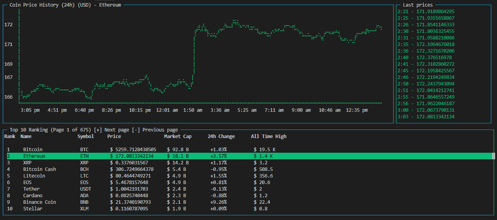

# Cryptocurrency Statistics CLI for Node.js



## Requirements
- Node.js. & NPM

## Instructions
```sh
$ npm install -g cryptostats-cli
$ cryptostats
```

## Dependencies
https://github.com/chjj/blessed

https://github.com/yaronn/blessed-contrib

https://github.com/axios/axios

https://github.com/moment/moment

## Data
https://docs.coinranking.com/
